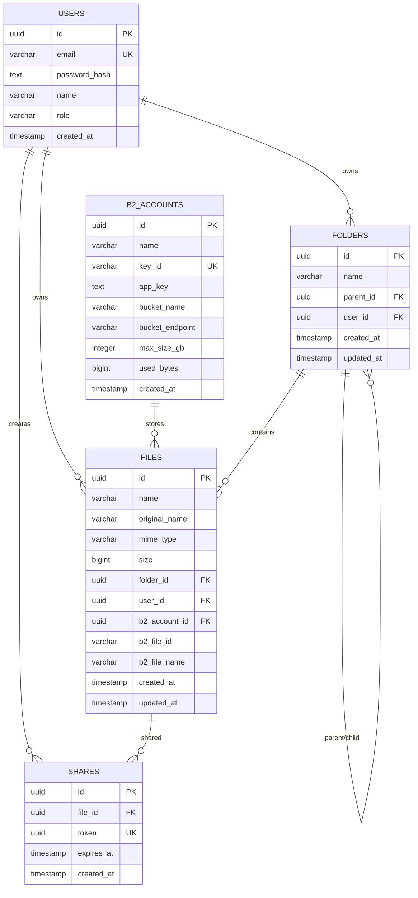

# Data Models

## Database Schema (PostgreSQL)

From `backend/src/db/init.js` + migrations in same file.

### ER Diagram



---

## Table Definitions

### users
```sql
CREATE TABLE users (
  id UUID PRIMARY KEY DEFAULT gen_random_uuid(),
  email VARCHAR(255) UNIQUE NOT NULL,
  password_hash TEXT NOT NULL,
  name VARCHAR(255),
  role VARCHAR(50) DEFAULT 'user',
  created_at TIMESTAMP WITH TIME ZONE DEFAULT NOW()
);
```
**Indexes**: PK on `id`, Unique on `email`

### b2_accounts
```sql
CREATE TABLE b2_accounts (
  id UUID PRIMARY KEY DEFAULT gen_random_uuid(),
  name VARCHAR(255) NOT NULL,
  key_id VARCHAR(255) UNIQUE NOT NULL,
  app_key TEXT NOT NULL,
  bucket_name VARCHAR(255) NOT NULL,
  bucket_endpoint VARCHAR(255) NOT NULL,
  max_size_gb INTEGER DEFAULT 10,
  used_bytes BIGINT DEFAULT 0,
  created_at TIMESTAMP WITH TIME ZONE DEFAULT NOW()
);
```
**Indexes**: PK on `id`, Unique on `key_id`  
**Migrations**: `used_bytes BIGINT DEFAULT 0`, `bucket_endpoint VARCHAR(255)`

### folders
```sql
CREATE TABLE folders (
  id UUID PRIMARY KEY DEFAULT gen_random_uuid(),
  name VARCHAR(255) NOT NULL,
  parent_id UUID REFERENCES folders(id) ON DELETE CASCADE,
  user_id UUID NOT NULL REFERENCES users(id) ON DELETE CASCADE,
  created_at TIMESTAMP WITH TIME ZONE DEFAULT NOW(),
  updated_at TIMESTAMP WITH TIME ZONE DEFAULT NOW()
);
```
**Indexes**: PK on `id`, FK on `parent_id` (CASCADE), FK on `user_id` (CASCADE)  
**Migration**: `updated_at` column

### files
```sql
CREATE TABLE files (
  id UUID PRIMARY KEY DEFAULT gen_random_uuid(),
  name VARCHAR(255) NOT NULL,
  original_name VARCHAR(255) NOT NULL,
  mime_type VARCHAR(255),
  size BIGINT NOT NULL,
  folder_id UUID REFERENCES folders(id) ON DELETE SET NULL,
  user_id UUID NOT NULL REFERENCES users(id) ON DELETE CASCADE,
  b2_account_id UUID NOT NULL REFERENCES b2_accounts(id) ON DELETE RESTRICT,
  b2_file_id VARCHAR(255) NOT NULL,
  b2_file_name VARCHAR(255) NOT NULL,
  created_at TIMESTAMP WITH TIME ZONE DEFAULT NOW(),
  updated_at TIMESTAMP WITH TIME ZONE DEFAULT NOW()
);
```
**Indexes**: PK on `id`, FK on `folder_id` (SET NULL), `user_id` (CASCADE), `b2_account_id` (RESTRICT)  
**Indexes created**: `idx_files_folder`, `idx_files_user`  
**Migration**: `updated_at` column

### shares
```sql
CREATE TABLE shares (
  id UUID PRIMARY KEY DEFAULT gen_random_uuid(),
  file_id UUID NOT NULL REFERENCES files(id) ON DELETE CASCADE,
  token UUID UNIQUE NOT NULL DEFAULT gen_random_uuid(),
  expires_at TIMESTAMP WITH TIME ZONE,
  created_at TIMESTAMP WITH TIME ZONE DEFAULT NOW()
);
```
**Indexes**: PK on `id`, Unique on `token`, FK on `file_id` (CASCADE)  
**Index created**: `idx_shares_token`

---

## API Response Types (TypeScript)

### User
```typescript
interface User {
  id: string;           // UUID
  email: string;
  name: string;         // "" if not set
  role: 'admin' | 'user';
}
```

### File
```typescript
interface BackendFile {
  id: string;                    // UUID
  name: string;                  // sanitized filename
  original_name: string;         // original upload name
  mime_type: string;             // MIME type
  size: number;                  // bytes (NUMBER, not string)
  folder_id: string | null;      // UUID or null for root
  user_id: string;               // UUID
  b2_account_id: string;         // UUID
  b2_file_id: string;            // B2 file ID
  b2_file_name: string;          // B2 stored filename
  created_at: number;            // Unix ms timestamp
  updated_at: number;            // Unix ms timestamp
}
```

### Folder
```typescript
interface Folder {
  id: string;                    // UUID
  name: string;
  parent_id: string | null;      // UUID or null for root
  user_id: string;               // UUID
  created_at: number;            // Unix ms
  updated_at: number;            // Unix ms
  children?: Folder[];           // only in /tree response
}
```

### Folder Tree Item (for sidebar)
```typescript
interface FolderTreeItem extends Folder {
  children?: FolderTreeItem[];
}
```

### Share
```typescript
interface Share {
  id: string;                    // UUID
  file_id: string;               // UUID
  token: string;                 // UUID
  shareUrl: string;              // full URL
  expiresAt: string | null;      // ISO 8601 or null
}
```

### B2 Account (API Response - no secrets)
```typescript
interface B2Account {
  id: string;                    // UUID
  name: string;
  bucket_name: string;
  bucket_endpoint: string;       // e.g., "s3.us-east-005.backblazeb2.com"
  max_size_gb: number;           // GB (integer)
  created_at: string;            // ISO 8601
}
```

### Storage Stats (GET /api/storage/stats)
```typescript
interface StorageStats {
  total: {
    used: number;        // bytes (NUMBER)
    max: number;         // bytes (NUMBER)
    free: number;        // bytes (NUMBER)
    percentage: number;  // 0-100 integer
  };
  accounts: StorageAccount[];
}

interface StorageAccount {
  id: string;
  name: string;
  bucketName: string;
  bucketEndpoint: string;
  used: number;          // bytes
  max: number;           // bytes
  free: number;          // bytes
  percentage: number;    // 0-100
  health: 'healthy' | 'degraded' | 'unhealthy';
  consecutiveFailures: number;
  available: boolean;    // false if unhealthy + in cooldown
}
```

### Share Link Response
```typescript
interface ShareLinkResponse {
  token: string;           // UUID
  shareUrl: string;        // Full frontend URL
  expiresAt: string | null; // ISO 8601 or null
}
```

### Upload Response
```typescript
interface UploadResponse extends BackendFile {}
```

### Error Response
```typescript
interface ApiError {
  error: string;
}
// Validation errors:
interface ValidationError {
  errors: Array<{
    type: string;
    path: string;
    msg: string;
    location: string;
  }>;
}
```

---

## Important Gotchas

### BIGINT Handling

**Database**: `used_bytes`, `size`, `max_size_gb * 1073741824` are `BIGINT` in PostgreSQL.

**API Returns**: **Numbers** (not strings)  
**Reason**: `backend/src/db/index.js` registers pg type parser:
```javascript
pg.types.setTypeParser(20, (val) => parseInt(val, 10)); // OID 20 = BIGINT
```
Values fit well within `Number.MAX_SAFE_INTEGER` (9e15) — max 50 GB = 5.3e10.

**Frontend**: Use `typeof size === 'number'` — no BigInt needed.

### Timestamps

**Database**: `TIMESTAMP WITH TIME ZONE`  
**API Returns**: Unix milliseconds (number) — e.g., `1701234567890`  
**Frontend**: `new Date(timestamp)` → `Date` object

### File Sizes

All sizes in **bytes** (number).  
Frontend formatting helper:
```typescript
function formatBytes(bytes: number): string {
  if (!bytes || bytes === 0) return '0 B';
  if (bytes < 0) return '0 B';
  const k = 1024;
  const sizes = ['B', 'KB', 'MB', 'GB', 'TB'];
  const i = Math.floor(Math.log(bytes) / Math.log(k));
  const unit = sizes[Math.min(i, sizes.length - 1)] || 'B';
  return parseFloat((bytes / Math.pow(k, i)).toFixed(2)) + ' ' + unit;
}
```

### UUID Format

Standard RFC4122 v4: `xxxxxxxx-xxxx-4xxx-yxxx-xxxxxxxxxxxx`  
All IDs in API are strings containing UUIDs.

### Nullable / Optional Fields

| Field | Nullable? | Notes |
|-------|-----------|-------|
| `File.folder_id` | Yes | `null` = root |
| `File.mime_type` | Yes | Can be null if detection failed |
| `File.updated_at` | No | Always set |
| `Folder.parent_id` | Yes | `null` = root |
| `Share.expiresAt` | Yes | `null` = no expiry |
| `StorageAccount.health` | No | Always present |
| `StorageAccount.free` | No | Computed: `max - used` |

---

## Frontend TypeScript Interface (Complete)

```typescript
// api/types.ts
export interface User {
  id: string;
  email: string;
  name: string;
  role: 'admin' | 'user';
}

export interface File {
  id: string;
  name: string;
  original_name: string;
  mime_type: string;
  size: number;
  folder_id: string | null;
  user_id: string;
  b2_account_id: string;
  b2_file_id: string;
  b2_file_name: string;
  created_at: number;
  updated_at: number;
}

export interface Folder {
  id: string;
  name: string;
  parent_id: string | null;
  user_id: string;
  created_at: number;
  updated_at: number;
  children?: Folder[];
}

export interface Share {
  token: string;
  shareUrl: string;
  expiresAt: string | null;
}

export interface B2Account {
  id: string;
  name: string;
  bucket_name: string;
  bucket_endpoint: string;
  max_size_gb: number;
  created_at: string;
}

export interface StorageStats {
  total: {
    used: number;
    max: number;
    free: number;
    percentage: number;
  };
  accounts: Array<{
    id: string;
    name: string;
    bucketName: string;
    bucketEndpoint: string;
    used: number;
    max: number;
    free: number;
    percentage: number;
    health: 'healthy' | 'degraded' | 'unhealthy';
    consecutiveFailures: number;
    available: boolean;
  }>;
}

export interface UploadResponse extends File {}
export interface ShareLinkResponse {
  token: string;
  shareUrl: string;
  expiresAt: string | null;
}
export interface ApiError { error: string; }
export interface ValidationError { errors: Array<{ type: string; path: string; msg: string; location: string }>; }
```