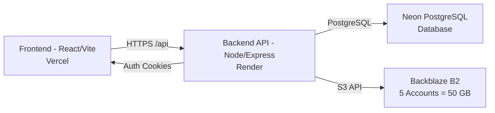

# PENTACLOUD Backend Documentation

## What is PENTACLOUD?

PENTACLOUD is a personal/team cloud storage platform that pools **5 Backblaze B2 accounts** (10 GB each = **50 GB total**) into a single unified storage backend. Files uploaded are automatically routed to the account with the most free space, with automatic failover if an account becomes unavailable.

## Architecture

**Data Flow:**
1. User authenticates via frontend → gets JWT access token (15 min) + refresh token (7 days, httpOnly cookie)
2. All API requests include `Authorization: Bearer <accessToken>`
3. File uploads → Backend reserves space atomically in DB → uploads to B2 → stores file metadata
4. Downloads/Previews → Backend streams from B2 via signed URL → proxies to frontend (browser never touches B2 directly)
5. Storage stats → Read from cached `used_bytes` in PostgreSQL (fast, no live B2 API calls)

## Tech Stack

| Layer | Technology | Version |
|-------|------------|---------|
| Runtime | Node.js | 20.x (ES Modules) |
| Framework | Express | 4.18+ |
| Database | PostgreSQL | 15+ (Neon Serverless) |
| ORM/Query | pg (node-postgres) | 8.11+ |
| Auth | JWT (jsonwebtoken) | 9.0+ |
| File Upload | multer | 1.4+ |
| B2 Client | backblaze-b2 | 1.7+ |
| Validation | express-validator | 7.0+ |
| Rate Limiting | express-rate-limit | 7.1+ |
| Password Hashing | bcrypt | 5.1+ |

## Backend Folder Structure (`backend/src/`)

| File | Purpose |
|------|---------|
| `index.js` | App entry: Express setup, CORS, rate limits, route mounting, global error handler, startup sequence |
| `routes/auth.js` | Auth endpoints: signup, login, refresh, logout, /me |
| `routes/files.js` | File CRUD: list, upload (small + large with failover), download, rename, move, delete |
| `routes/folders.js` | Folder CRUD: list, tree, create, rename, move, delete |
| `routes/shares.js` | Share links: create, download via token, delete |
| `routes/storage.js` | Storage stats: GET /stats (cached from DB) |
| `routes/settings.js` | Admin: B2 account management, storage reconciliation |
| `middleware/auth.js` | JWT generation/verification, cookie handling, auth middlewares |
| `middleware/validate.js` | express-validator rules for all endpoints |
| `services/b2.js` | Backblaze B2 service: auth caching, upload URL caching, download auth caching, upload/download/delete, failover, health tracking |
| `db/index.js` | pg Pool setup, query helper, BIGINT parser (returns numbers not strings) |
| `db/init.js` | Schema creation + migrations + startup storage consistency check |
| `db/seed.js` | Seeds 5 B2 accounts from env + default admin user |
| `utils/sanitizeError.js` | Redacts secrets from error logs |

---

## Documentation Index

| File | Description |
|------|-------------|
| [API.md](API.md) | **Complete endpoint reference** - every route with request/response shapes |
| [AUTHENTICATION.md](AUTHENTICATION.md) | Auth flow, tokens, cookies, roles, rate limits |
| [FILE_UPLOAD_AND_DOWNLOAD.md](FILE_UPLOAD_AND_DOWNLOAD.md) | Upload contract, progress, large files, download/preview |
| [DATA_MODELS.md](DATA_MODELS.md) | Database schema, API response types, ER diagram |
| [STORAGE_AND_B2.md](STORAGE_AND_B2.md) | Multi-account routing, failover, health, reconcile |
| [ENVIRONMENT.md](ENVIRONMENT.md) | All env vars, local setup, Render/Vercel deploy |
| [ERRORS_AND_GOTCHAS.md](ERRORS_AND_GOTCHAS.md) | Error shapes, known pitfalls, frontend checklist |
| [openapi.yaml](openapi.yaml) | OpenAPI 3.0 spec |
| [postman_collection.json](postman_collection.json) | Postman collection with env vars |
| [FRONTEND_INTEGRATION_GUIDE.md](FRONTEND_INTEGRATION_GUIDE.md) | Axios client, typed API layer, screens checklist |