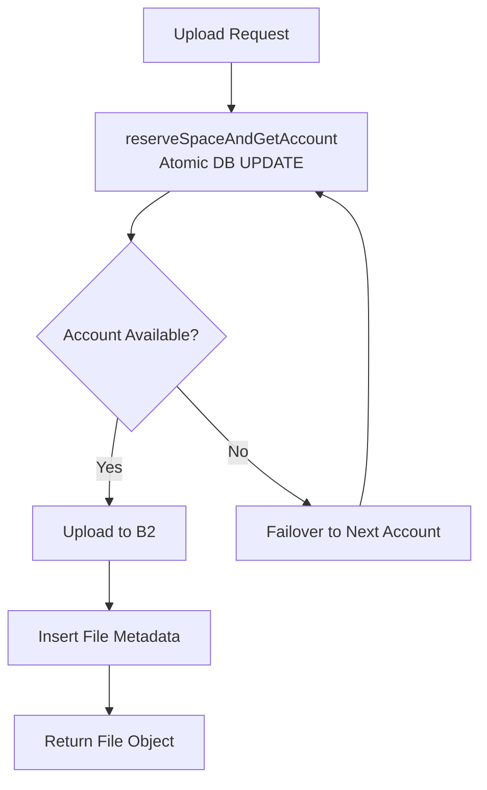

# Storage & Backblaze B2 Architecture

## Overview

PENTACLOUD pools **5 Backblaze B2 accounts** (10 GB each = **50 GB total**) into a unified storage layer. Files are automatically routed to the account with the most free space, with automatic failover and health monitoring.

---

## Storage Architecture



---

## Account Selection & Space Reservation

### Atomic Reservation (`reserveSpaceAndGetAccount`)

Single SQL statement selects AND reserves space atomically:

```sql
UPDATE b2_accounts 
SET used_bytes = used_bytes + $1 
WHERE id = (
  SELECT id FROM b2_accounts 
  WHERE used_bytes + $1 <= (max_size_gb::bigint * 1073741824) 
  ORDER BY used_bytes ASC 
  LIMIT 1
)
RETURNING *
```

**Properties**:
- **Atomic**: No race condition between concurrent uploads
- **Ordered by `used_bytes ASC`**: Fills accounts sequentially
- **Excludes unhealthy accounts**: `isAccountAvailable()` filters out unhealthy
- **Excludes full accounts**: `used_bytes + fileSize <= max_size_gb * 1073741824`

### Exclusion for Failover

```sql
-- excludeAccountIds passed as parameters
AND id NOT IN ($2, $3, ...)
```

---

## Upload Flow

### Small Files (< 100 MB)
1. `reserveSpaceAndGetAccount(fileSize)` → atomically reserves space
2. Read file into memory
3. `uploadFileWithFailover()` → tries account, fails over on persistent failure
3. On success: `recordAccountSuccess(accountId)`, insert file metadata
4. On failure: `rollbackReservedSpace()`, try next account

### Large Files (≥ 100 MB)
1. `reserveSpaceAndGetAccount(fileSize)` → atomically reserves space
2. Stream from temp file to B2 Large File API:
   - `startLargeFile` → get `fileId`
   - Loop: `getUploadPartUrl` → `uploadPart` (100 MB chunks) with 3 retries each
   - `finishLargeFile` with all part SHA1s
3. On success: insert file metadata
4. On failure: `cancelLargeFile`, `rollbackReservedSpace()`, try next account

**Threshold**: `100 MB` (104,857,600 bytes) — `LARGE_FILE_THRESHOLD` in `files.js:15`

---

## B2 Caching (Performance Optimizations)

### 1. Authorization Cache (`b2.authorize()`)
- Called **once at startup** per account
- Token cached in memory (`client.b2` instance)
- Auto-reauthorize on 401 (token expired after 24h)

### 2. Upload URL Cache
- `getUploadUrl()` returns `uploadUrl` + `authorizationToken`
- Cached per account (`client.uploadUrl`, `client.uploadAuthToken`)
- Reused for all uploads to that account
- Refreshed on expiry (B2 returns `expired_auth_token` / `invalid_auth_token`)

### 3. Download Authorization Cache
- `getDownloadAuthorization(bucketId, 3600)` → token valid 1 hour
- Cached per account (`downloadAuthToken`, `downloadAuthExpiresAt`)
- Reused for all downloads/previews
- Auto-refresh on 401/403/`bad_auth_token`/`expired_auth_token`

---

## Account Health & Failover

### Health States (In-Memory, Resets on Restart)

| State | Criteria | Eligible for Upload? |
|-------|----------|---------------------|
| `healthy` | 0 failures | ✅ Yes (priority) |
| `degraded` | 1-2 consecutive failures | ✅ Yes (lower priority) |
| `unhealthy` | ≥ 3 consecutive failures | ❌ No (cooldown) |

### Transitions

```javascript
// On failure
recordAccountFailure(accountId):
  consecutiveFailures++
  if >= 3: status = 'unhealthy', lastFailureAt = now()
  else if >= 1: status = 'degraded'

// On success
recordAccountSuccess(accountId):
  consecutiveFailures = 0
  status = 'healthy'
  lastFailureAt = 0

// Auto-recovery after cooldown
isAccountAvailable(accountId):
  if unhealthy && (now - lastFailureAt > 2 min):
    recordAccountSuccess(accountId)  // auto-recovers
    return true
  return status !== 'unhealthy'
```

**Cooldown**: 2 minutes (`UNHEALTHY_COOLDOWN_MS = 2 * 60 * 1000`)

### Failover Logic (`uploadFileWithFailover`)

```javascript
for (attempt = 1 to 3):
  account = reserveSpaceAndGetAccount(fileSize, triedAccountIds)
  try:
    result = uploadFile(account.id, ...)
    recordAccountSuccess(account.id)
    return result
  catch (err):
    recordAccountFailure(account.id)
    rollbackReservedSpace(account.id, fileSize)  // ALWAYS runs
    triedAccountIds.push(account.id)
    if attempt < 3: continue
    throw lastError
```

**Guarantee**: Rollback **always** runs before failover (wrapped in try/catch, logged as CRITICAL if fails).

---

## Storage Stats (GET /api/storage/stats)

### Response (Cached from DB — No Live B2 Calls)

```json
{
  "total": {
    "used": 16171040,
    "max": 53687091200,
    "free": 53670920160,
    "percentage": 0
  },
  "accounts": [
    {
      "id": "uuid",
      "name": "Account 1",
      "bucketName": "bucket-1",
      "bucketEndpoint": "s3.us-east-005.backblazeb2.com",
      "used": 8085520,
      "max": 10737418240,
      "free": 10729332720,
      "percentage": 0,
      "health": "healthy",
      "consecutiveFailures": 0,
      "available": true
    }
  ]
}
```

**All size fields are NUMBERS** (not strings) — pg BIGINT parser converts them.

### Fields

| Field | Type | Description |
|-------|------|-------------|
| `total.used` | number | Total bytes used across all accounts |
| `total.max` | number | Total capacity (50 GB = 53,687,091,200) |
| `total.free` | number | `max - used` |
| `total.percentage` | int 0-100 | Rounded |
| `accounts[].used` | number | Per-account bytes used |
| `accounts[].max` | number | Per-account capacity (10 GB = 10,737,418,240) |
| `accounts[].health` | enum | `healthy` \| `degraded` \| `unhealthy` |
| `accounts[].consecutiveFailures` | int | Failure counter |
| `accounts[].available` | bool | `false` during unhealthy cooldown |

---

## Storage Reconciliation (Admin)

### POST /api/settings/b2-accounts/reconcile

Recalculates `used_bytes` from actual file sizes in DB:

```sql
UPDATE b2_accounts ba
SET used_bytes = COALESCE((
  SELECT SUM(f.size) FROM files f WHERE f.b2_account_id = ba.id
), 0)
RETURNING id, name, used_bytes
```

**Use when**: `used_bytes` drift suspected (failed deletes, failed rollbacks, manual DB edits)  
**Run via**: Admin Settings page → "Sync Storage" button

---

## Admin B2 Account Configuration

### 4 Required Variables per Account

| Env Var | Description | Example |
|---------|-------------|---------|
| `B2_1_NAME` | Display name | `Account 1` |
| `B2_1_KEY_ID` | Application Key ID | `000000000000000000000001` |
| `B2_1_APP_KEY` | Application Key | `K00000000000000000000000000000000000` |
| `B2_1_BUCKET_NAME` | Bucket name | `pentacloud-1` |
| `B2_1_BUCKET_ENDPOINT` | **Full S3 endpoint** | `s3.us-east-005.backblazeb2.com` |
| `B2_1_MAX_SIZE_GB` | Optional, default 10 | `10` |

**Repeat for B2_2 through B2_5**

### Seeding

Runs on startup via `seedB2Accounts()` in `db/seed.js`:
- Upserts by `key_id` (unique)
- Updates `app_key`, `bucket_name`, `bucket_endpoint`, `max_size_gb` on conflict

---

## Retry & Backoff Strategy

### Transient Errors (Retried)
- Network: `ECONNREFUSED`, `ETIMEDOUT`, `ENOTFOUND`, `ENETUNREACH`
- HTTP 5xx, 429

### Backoff Schedule
| Attempt | Delay |
|---------|-------|
| 1 | 500 ms |
| 2 | 1000 ms |
| 3 | 2000 ms |

**Max retries**: 3 (defined in `executeWithGeneralRetry`)

---

## Render Free Tier Considerations

| Issue | Impact | Mitigation |
|-------|--------|------------|
| Cold start | 30-50 sec first request | Frontend timeout ≥ 5 min |
| Memory limit | 512 MB | Disk-based multer storage (no file in memory) |
| Sleep after inactivity | First request slow | Frontend shows loading state |
| No persistent disk | Temp uploads lost on restart | Cleaned up after each upload |

---

## Storage Dashboard (Frontend)

The `StorageDashboard` component (`frontend/src/components/StorageDashboard.tsx`) provides a real-time view of storage usage across all B2 accounts.

### Live Auto-Refresh

- **Auto-refresh**: Enabled by default, polls every 30 seconds (`AUTO_REFRESH_INTERVAL = 30000`)
- **Smart caching**: 30-second cache TTL prevents unnecessary API calls
- **Pause/Resume**: User can toggle auto-refresh on/off via header button
- **Manual refresh**: Always available via refresh button
- **Visual indicator**: Green "Live" badge with pulsing play icon when active, pause icon when paused

### Component Features

- **Total storage**: Used / Max / Percentage with progress bar
- **Per-account breakdown**: Used, max, free, percentage, health status
- **Health indicators**: Healthy (green), Degraded (yellow), Unhealthy (red)
- **Activity feed**: Recent uploads/downloads (desktop sidebar)
- **Admin reconile button**: Sync Storage button in Settings (admin only)

### Configuration Constants

```typescript
const CACHE_TTL = 30 * 1000;           // 30-second cache TTL
const AUTO_REFRESH_INTERVAL = 30 * 1000; // 30-second auto-refresh
```

### Configuration Constants

```typescript
const CACHE_TTL = 30 * 1000;           // 30-second cache TTL
const AUTO_REFRESH_INTERVAL = 30 * 1000; // 30-second auto-refresh
```

### Health Badge Colors
| Health | Color | Label |
|--------|-------|-------|
| `healthy` | Green | "Healthy" |
| `degraded` | Yellow | `Degraded (N failures)` |
| `unhealthy` | Red | "Unhealthy" |

### Storage Bar Color
| Percentage | Color |
|------------|-------|
| < 70% | Blue |
| 70-89% | Yellow |
| ≥ 90% | Red |

---

## Key Endpoints Summary

| Endpoint | Purpose |
|----------|---------|
| `GET /api/storage/stats` | Cached stats (fast) |
| `POST /api/settings/b2-accounts/reconcile` | Recalculate used_bytes from DB |
| `POST /api/settings/b2-accounts` | Add B2 account (admin) |
| `DELETE /api/settings/b2-accounts/:id` | Remove account (must be empty) |

---

## Monitoring Points

Watch for in logs:
- `[B2 FAILOVER] Attempt X/3` → account failing over
- `[B2 HEALTH] Account X marked UNHEALTHY` → needs attention
- `[UPLOAD] B2 upload failed... rolling back` → reservation leaked?
- `⚠️ STORAGE INCONSISTENCY DETECTED` → run reconcile